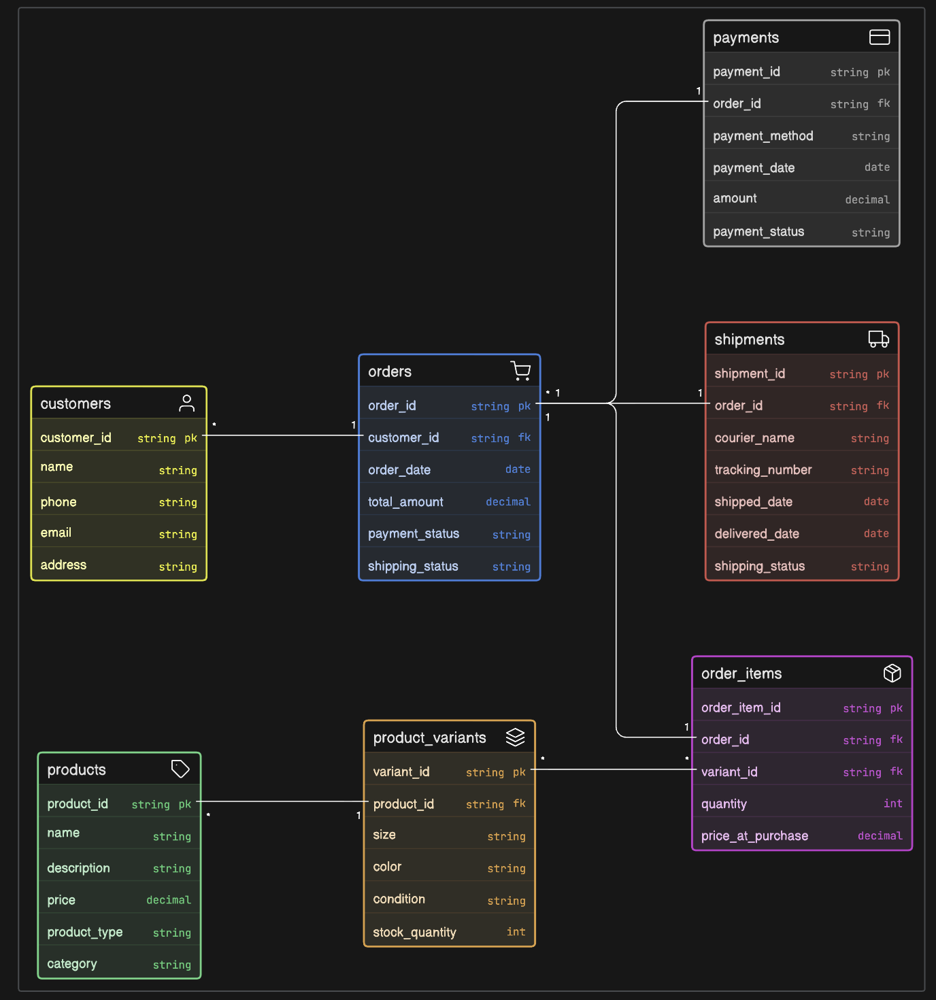
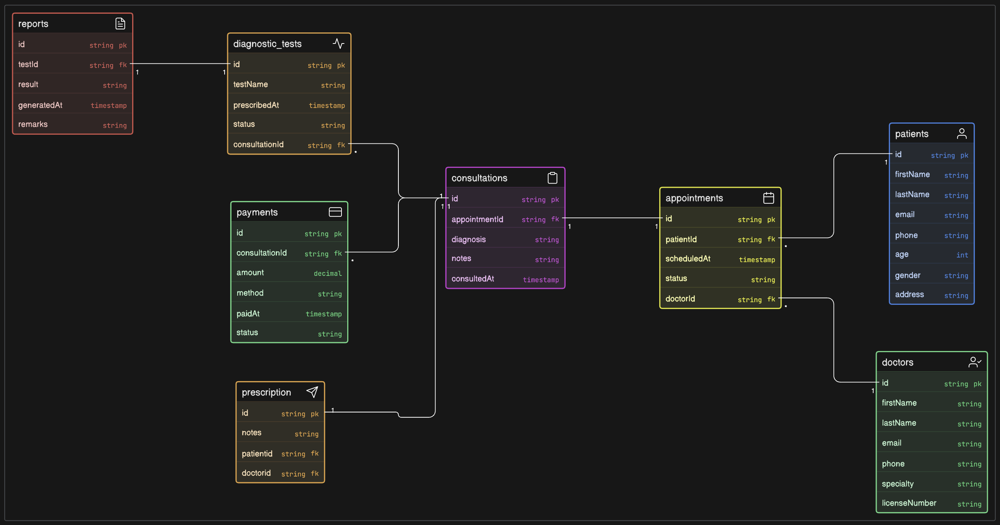
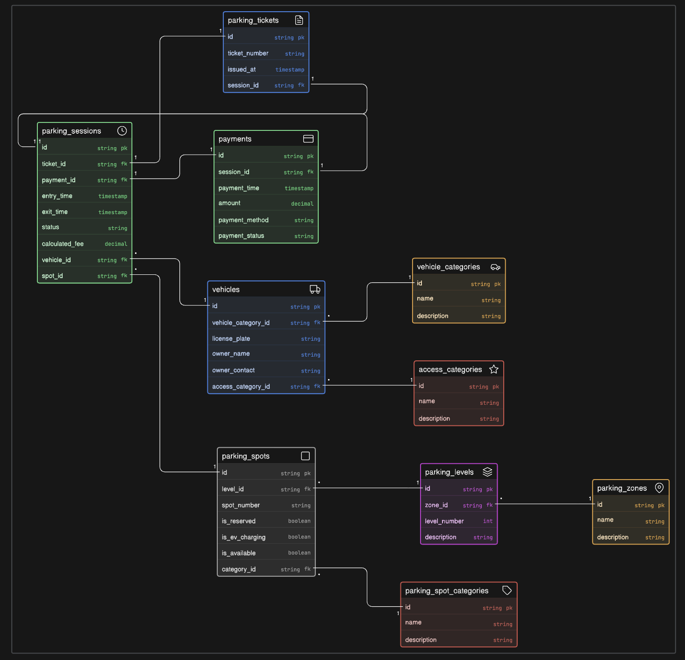
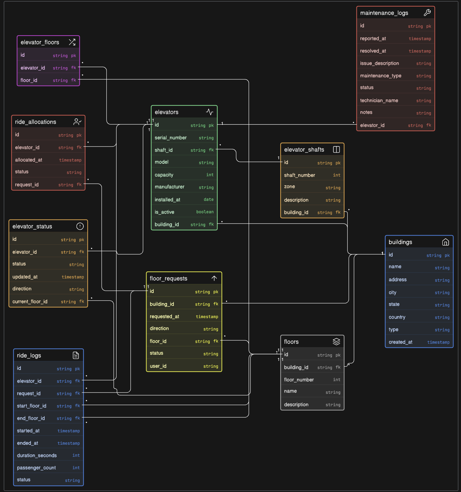

# 📊 Database Design Projects

This repository contains ER diagram designs for four real-world systems:

1. 🛍️ Instagram Thrift Store Management System  
2. 🏥 Clinic Management System  
3. 🚗 Comic-Con Parking Management System  
4. 🛗 Smart Elevator Control System  

---

# 🛍️ Instagram Thrift Store Database

## 📌 Overview
This system is designed for a small Instagram-based business that sells:
- Thrifted (unique, single-piece) items  
- Handmade (multi-unit) products  

Initially managed via DMs and WhatsApp, this design helps scale operations by structuring:
- Inventory
- Orders
- Customers
- Payments
- Shipping

---

## 🧩 Key Features

- Supports **both unique and reusable inventory**
- Tracks **product variants** (size, color, condition)
- Handles **multiple orders per customer**
- Supports **multiple items per order**
- Tracks **payment and shipping status**

---

## 🏗️ Entities

- **Customer**
- **Order**
- **Product**
- **Variant (Inventory)**
- **OrderItem (Junction Table)**
- **Payment**
- **Shipment**

---

## 🔗 Relationships

- One customer → many orders  
- One order → many order items  
- One product → many variants  
- Many-to-many between orders and products (via OrderItem)  
- One order → one payment  
- One order → one shipment  

---

## 💡 Special Design Considerations

- Thrift items → `stock_quantity = 1`  
- Handmade items → `stock_quantity > 1`  
- Condition attribute added for thrift products  
- Price stored in OrderItem to preserve historical pricing  

---

## 📷 ER Diagram

---

# 🏥 Clinic Management System Database

## 📌 Overview

This system models a clinic where:
- Patients book appointments
- Doctors diagnose and prescribe treatments
- Staff manages records, billing, and schedules

---

## 🧩 Key Features

- Patient record management  
- Appointment scheduling  
- Doctor specialization tracking  
- Prescription and treatment records  
- Billing and payment tracking  

---

## 🏗️ Entities

- **Patient**
- **Doctor**
- **Appointment**
- **Prescription**
- **Medicine**
- **Billing / Payment**
- **Staff (optional)**

---

## 🔗 Relationships

- One patient → many appointments  
- One doctor → many appointments  
- One appointment → one prescription  
- One prescription → many medicines  
- One appointment → one billing record  

---

## 💡 Special Design Considerations

- Appointment acts as a **central entity**  
- Prescriptions linked to appointments (not directly to patients)  
- Supports **doctor specialization**  
- Billing separated for better financial tracking  

---

## 📷 ER Diagram

---

# 🚗 Comic-Con Parking Management System

## 📌 Overview

This system is designed to manage parking for large-scale events like Comic-Con, where:
- Thousands of attendees arrive with vehicles
- Parking slots must be efficiently allocated
- Entry, exit, and payments must be tracked

---

## 🧩 Key Features

- Real-time parking slot allocation  
- Vehicle entry and exit tracking  
- Ticket-based parking system  
- Payment handling (hourly or fixed)  
- Support for different vehicle types (car, bike, VIP)  

---

## 🏗️ Entities

- **Vehicle**
- **Owner / Attendee**
- **ParkingSlot**
- **ParkingTicket**
- **Payment**
- **ParkingLot / Zone**

---

## 🔗 Relationships

- One attendee → can have multiple vehicles  
- One vehicle → gets one active parking ticket at a time  
- One parking slot → assigned to one ticket at a time  
- One parking ticket → linked to one vehicle and one slot  
- One ticket → one payment  
- One parking lot → contains multiple parking slots  

---

## 💡 Special Design Considerations

- Parking slots categorized (VIP, regular, bike)  
- Ticket stores **entry_time and exit_time**  
- Payment calculated based on parking duration  
- Ensures **no double allocation of slots**  
- Supports scalability for large events  

---

## 📷 ER Diagram

---

# 🛗 Smart Elevator Control System

## 📌 Overview

This system is designed to manage elevators in smart buildings such as offices, malls, or apartments, where:
- Multiple elevators serve multiple floors  
- Users request elevators dynamically  
- System optimizes movement and reduces wait time  

---

## 🧩 Key Features

- Elevator request handling (up/down calls)  
- Real-time elevator status tracking  
- Floor and direction management  
- Efficient allocation of elevators  
- Logging trips and movement history  

---

## 🏗️ Entities

- **Building**
- **Floor**
- **Elevator**
- **Request**
- **Trip / MovementLog**
- **User (optional)**

---

## 🔗 Relationships

- One building → many floors  
- One building → many elevators  
- One floor → can generate many requests  
- One elevator → handles many requests  
- One request → assigned to one elevator  
- One elevator → logs many trips/movements  

---

## 💡 Special Design Considerations

- Requests include **source_floor, destination_floor, direction**  
- Elevator maintains **current_floor, status (idle/moving), direction**  
- System must avoid **conflicting assignments**  
- Trip logs help in **analytics and optimization**  
- Designed for **real-time scalability**  

---

## 📷 ER Diagram

---
